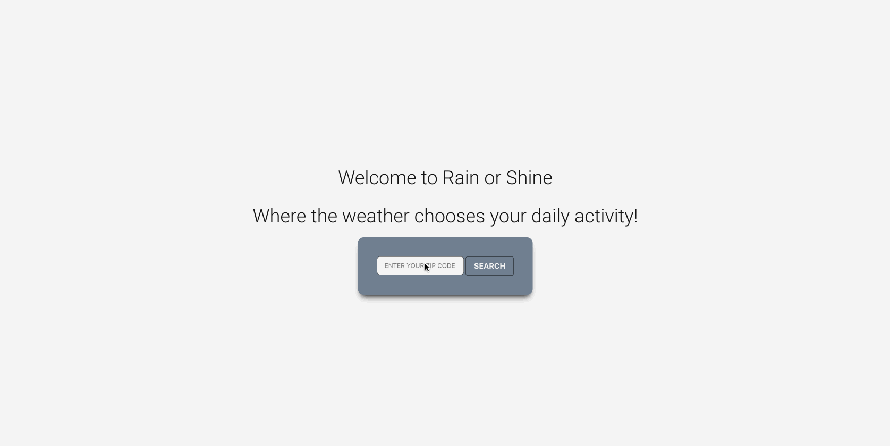

# rain-or-shine

Description:
  Rain or Shine is an application that will help users discover nearby activities that are appropriate for the current weather conditions.

  Contact: MattMakesCode@gmail.com

  Link: https://mattp303.github.io/Rain-or-Shine/

License: MIT

Technologies Implemented:
  HTML, JAVASCRIPT, BULMA, CSS

Project collaborators: Darrin, Krys, Matt, Norman